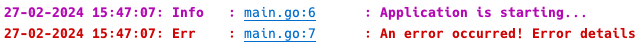
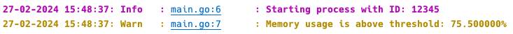
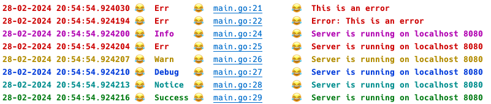

= golog

`golog` is a logging library for Go that enables easy customization of logging messages, including message coloring and configuring date and time formats based on specified languages.

== Features

* Color-coded log levels for easy differentiation.
* Global configuration of date and time format through the `SetLanguage` function.
* Support for multiple languages for date and time formatting.
* Allows users to define custom date and time formats.

== Installation

To use the `golog` package in your Go project, use the `go get` command to add it to your dependencies:

----
go get github.com/Olprog59/golog
----

=== Configuring Language

The `golog` library supports configuring the date and time format according to the specified language. You can set the desired language using the `SetLanguage` function in your program's `init` function.

[source,go]
----
func init() {
    golog.SetLanguage("fr") // Sets the date and time format to French
}
----

=== Supported Languages

The library supports the following languages with their respective date and time formats:

* en: "01-02-2006 3:04 PM"
* fr: "02-01-2006 15:04"
* de: "02.01.2006 15:04"
* zh: "2006年01月02日 15:04"
* ja: "2006年01月02日 15:04"
* ru: "02.01.2006 15:04"
* es: "02-01-2006 15:04"
* it: "02-01-2006 15:04"
* ar: "02/01/2006 15:04"
* default: "2006-01-02 15:04"

By default, if no language is set, `golog` uses the ISO 8601 format (`YYYY-MM-DD HH:MM`) for timestamps.

=== Setting the Language

To set the language for your logs, it is recommended to call the `SetLanguage` function in the `init` function of your program. This ensures that the language setting is applied before any logs are generated. If not set, `golog` will use the default ISO 8601 format.

== Advanced Customization

In addition to language configuration, `golog` allows for advanced customization of the date and time format. You can define your own custom format for date and time using the `SetCustomTimeFormat` function.

[source,go]
----
func init() {
    // Example of a custom date and time format
    golog.SetCustomTimeFormat("Mon Jan _2 15:04:05 2006")
}
----

This feature provides maximum flexibility, allowing users to specify any date and time format that follows the `time.Format` specification in Go.

https://golang.org/pkg/time/#pkg-constants[Golang time constants]

== Importance of Language Configuration

It is recommended to configure the desired language using the `SetLanguage` function within the `init` function to ensure all logs are correctly formatted according to the specified language conventions. This provides a localized experience for users across different regions.

NOTE: If both `SetLanguage` and `SetCustomTimeFormat` are used, the last applied setting will take precedence. This means that if you set a language using `SetLanguage` and then specify a custom time format using `SetCustomTimeFormat`, the custom time format will override the language-specific date and time format. Conversely, if `SetCustomTimeFormat` is called before `SetLanguage`, the language setting will override the custom format.

== Usage

After installing the package, you can import it into your Go project and start logging messages with different severity levels. Here's a basic example:

[source,go]
----
package main

import (
	"github.com/Olprog59/golog"
)

func init() {
    golog.SetLanguage("fr")
	golog.EnableFileNameLogging()
}

func main() {
	golog.Info("Application is starting...")
	golog.Err("An error occurred! %s", "Error details")
}
----

== Features

The `golog` package provides the following functions for logging:

- `Err(message string, params ...any)`: Logs an error message.
- `Warn(message string, params ...any)`: Logs a warning message.
- `Debug(message string, params ...any)`: Logs a debug message.
- `Info(message string, params ...any)`: Logs an informational message.
- `Notice(message string, params ...any)`: Logs a notice message.
- `Success(message string, params ...any)`: Logs a success message.

Each function accepts a string message followed by a variadic number of parameters that will be formatted and included in the log message.

== Advanced Usage

In addition to basic logging, you can include flags in your log messages for more detailed information. Here's how you can use flags:

[source,go]
----
package main

import (
	"github.com/Olprog59/golog"
)

func init() {
    golog.SetLanguage("fr")
	golog.EnableFileNameLogging()
}

func main() {
	golog.Info("Starting process with ID: %d", 12345)
	golog.Warn("Memory usage is above threshold: %f%%", 75.5)
}
----

This allows for dynamic inclusion of relevant data directly in your log messages, making them more informative and useful for debugging purposes.

== Example

[source,go]
----
package main

import (
	"errors"
	"github.com/Olprog59/golog"
)

func init() {
    golog.SetLanguage("fr")
	golog.EnableFileNameLogging()
}

func main() {
	url := "localhost"
	port := "8080"

	err := errors.New("This is an error")
	golog.Err(err.Error())
	golog.Err("Error: %s", err.Error())

	golog.Info("Server is running on %s %s", url, port)
	golog.Err("Server is running on %s %s", url, port)
	golog.Warn("Server is running on %s %s", url, port)
	golog.Debug("Server is running on %s %s", url, port)
	golog.Notice("Server is running on %s %s", url, port)
	golog.Success("Server is running on %s %s", url, port)
}
----

== File Name and Line Number Logging

`golog` allows for the inclusion of the file name and line number in log messages, providing additional context that can be particularly useful for debugging purposes. By default, this feature is disabled to keep log messages concise.

=== Enabling File Name and Line Number Logging

To include the file name and line number in your log messages, call the `EnableFileNameLogging` function. This is typically done in the init function of your main package. By default, file name and line number logging is *disabled*.

[source,go]
----
func init() {
    golog.EnableFileNameLogging()
}
----

With file name and line number logging enabled, log messages will include the source file name and the line number from where the log function was called, providing a precise reference for each log entry.

=== Example Log Message with File Name and Line Number

With file name and line number logging enabled, a log message would look like this:

[source,go]
----
2023-03-15 10:00:00: INFO : main.go:25 : Application is starting...
----

This format adds a new level of detail to your logs, making it easier to trace log messages back to their source in your codebase.

== License

This package is distributed under the MIT license, allowing you to freely use it in both personal and commercial projects.
