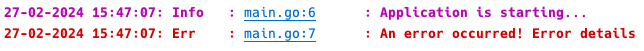
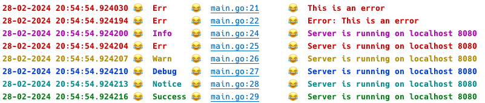

= golog

`golog` is a logging library for Go that enables easy customization of logging messages, including message coloring, configurable date/time formats, syslog forwarding, and session/user context.

== Installation

[source,bash]
----
go get github.com/Olprog59/golog@latest
----

== Features

* Color-coded log levels for easy visual differentiation.
* Global configuration of date and time format via `SetLanguage`.
* Support for multiple languages for date and time formatting.
* Custom date and time format via `SetCustomTimeFormat`.
* Configurable time precision (milliseconds, microseconds, nanoseconds).
* Optional file name and line number in log output.
* Syslog forwarding (local or remote, TCP/UDP).
* Session ID and User ID context via `*WithID` functions.
* Thread-safe — all configuration and logging functions are safe for concurrent use.

== Log Levels

The following functions are available for logging:

[cols="2,1,4"]
|===
|Function |Level |Description

|`Err(message, params...)`       |`Err`     |Error message
|`Warn(message, params...)`      |`Warn`    |Warning message
|`Debug(message, params...)`     |`Debug`   |Debug message
|`Info(message, params...)`      |`Info`    |Informational message
|`Notice(message, params...)`    |`Notice`  |Notice message
|`Success(message, params...)`   |`Success` |Success message
|===

Each function accepts a format string followed by optional arguments, identical to `fmt.Sprintf`.

== Usage

[source,go]
----
package main

import "github.com/Olprog59/golog"

func init() {
    golog.SetLanguage("fr")
    golog.EnableFileNameLogging()
}

func main() {
    golog.Info("Application is starting...")
    golog.Err("An error occurred: %s", "connection timeout")
}
----

== Configuration

=== Language

Sets the date and time format according to the specified locale. Call this in `init` before any log is generated.

[source,go]
----
func init() {
    golog.SetLanguage("fr")
}
----

Supported locales:

[cols="1,2"]
|===
|Code |Format

|`en`      |`01-02-2006 3:04:05 PM`
|`fr`      |`02-01-2006 15:04:05`
|`de`      |`02.01.2006 15:04:05`
|`zh`      |`2006年01月02日 15:04:05`
|`ja`      |`2006年01月02日 15:04:05`
|`ru`      |`02.01.2006 15:04:05`
|`es`      |`02-01-2006 15:04:05`
|`it`      |`02-01-2006 15:04:05`
|`ar`      |`02/01/2006 15:04:05`
|_(default)_ |`2006-01-02 15:04:05`
|===

=== Time Precision

Adds sub-second precision to the timestamp.

[cols="1,2"]
|===
|Constant |Suffix

|`golog.MILLI` |`.000`
|`golog.MICRO` |`.000000`
|`golog.NANO`  |`.000000000`
|===

[source,go]
----
func init() {
    golog.SetTimePrecision(golog.MICRO)
}
----

=== Custom Time Format

Overrides the language format with any layout compatible with Go's `time.Format`.

[source,go]
----
func init() {
    golog.SetCustomTimeFormat("Mon Jan _2 15:04:05 2006")
}
----

NOTE: `SetLanguage` and `SetCustomTimeFormat` override each other — the last one called takes effect.

See https://golang.org/pkg/time/#pkg-constants[Golang time constants] for available layout tokens.

=== Separator

Changes the delimiter between log fields. Default is ` | `.

[source,go]
----
func init() {
    golog.SetSeparator(" >> ")
}
----

=== File Name and Line Number

Includes the source file and line number in each log entry. Disabled by default.

[source,go]
----
func init() {
    golog.EnableFileNameLogging()
}
----

Example output with file logging enabled:

----
15-04-2024 10:00:00 | Info    | main.go:25      | Application is starting...
----

== Syslog

`golog` can forward log messages to a local or remote syslog server over TCP or UDP.

[source,go]
----
func init() {
    err := golog.InitSyslog("tcp", "10.0.0.1:514", "my-app")
    if err != nil {
        golog.Err("syslog unavailable: %s", err)
    }
}
----

Messages are forwarded in JSON format alongside the standard colored terminal output. If syslog is not initialized, no forwarding occurs and there is no performance overhead.

== Session and User Context

The `*WithID` functions attach a `sessionID` and `userID` to both the terminal output and the JSON syslog payload.

[cols="2,4"]
|===
|Function |Description

|`ErrorWithID(message, sessionID, userID, params...)`   |Error with context
|`WarnWithID(message, sessionID, userID, params...)`    |Warning with context
|`DebugWithID(message, sessionID, userID, params...)`   |Debug with context
|`InfoWithID(message, sessionID, userID, params...)`    |Info with context
|`NoticeWithID(message, sessionID, userID, params...)`  |Notice with context
|`SuccessWithID(message, sessionID, userID, params...)` |Success with context
|===

Empty strings are silently omitted from the output.

[source,go]
----
golog.InfoWithID("User logged in", "sess-abc123", "user-42")
golog.WarnWithID("Quota nearly reached", "sess-abc123", "")
----

== Full Example

[source,go]
----
package main

import "github.com/Olprog59/golog"

func init() {
    golog.SetLanguage("fr")
    golog.SetTimePrecision(golog.MICRO)
    golog.SetSeparator(" | ")
    golog.EnableFileNameLogging()

    if err := golog.InitSyslog("tcp", "10.0.0.1:514", "my-app"); err != nil {
        golog.Err("syslog init failed: %s", err)
    }
}

func main() {
    golog.Info("Server is running on %s:%s", "localhost", "8080")
    golog.Debug("Debug mode active")
    golog.Warn("Memory usage high: %.1f%%", 87.3)
    golog.Err("Connection failed: %s", "timeout")
    golog.Notice("Scheduled task started")
    golog.Success("Request processed successfully")

    golog.InfoWithID("User action", "sess-xyz", "user-99")
    golog.ErrorWithID("Payment failed", "sess-xyz", "user-99")
}
----

== License

This package is distributed under the MIT license, allowing free use in personal and commercial projects.
